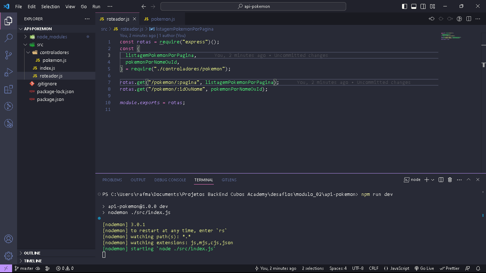
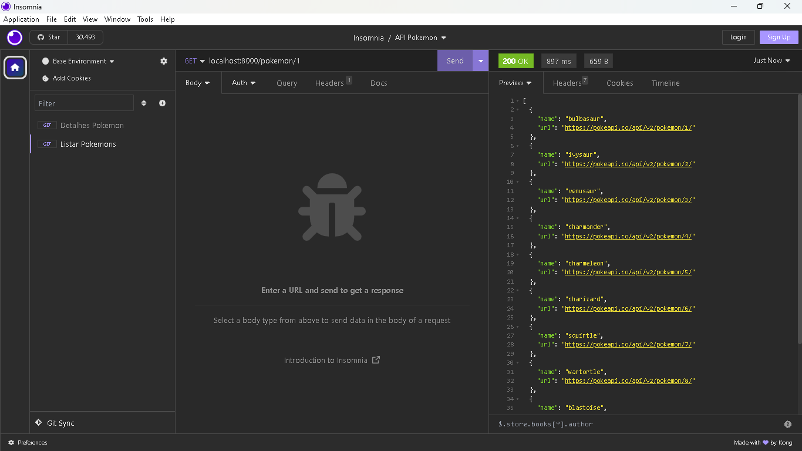
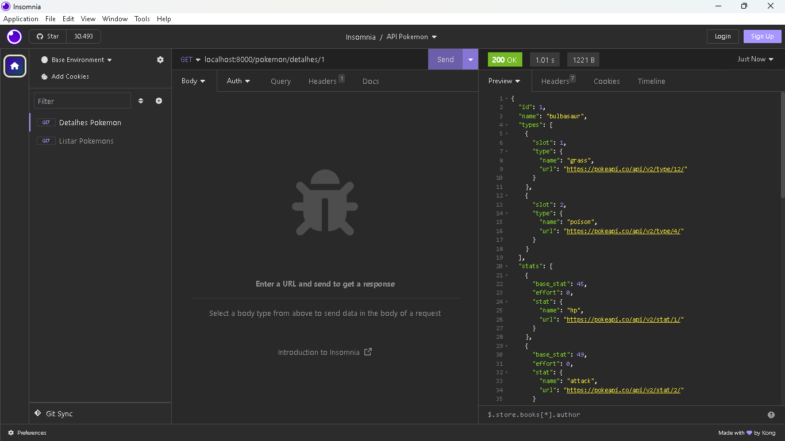
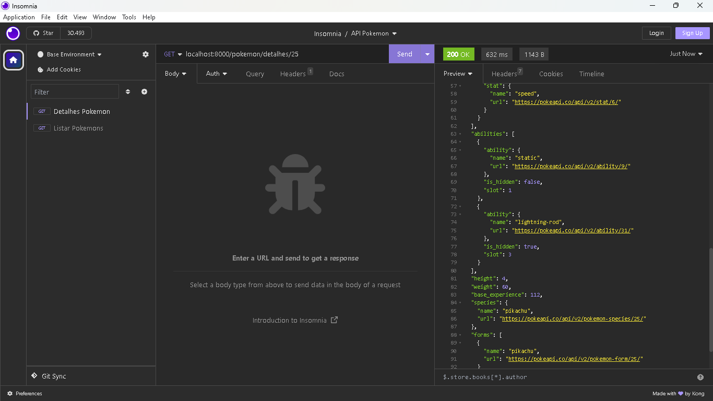

# API-Pokemon

Uma API de Pokemon criada em Node.js e Express por mim, Rafael Maurício, para um exercício do módulo 02 do curso de Desenvolvimento de Software da Cubos Academy, que retorna informações relacionada a pokemon.

## Pré-requisitos

1. Um interpretador como:
   

2. Um gerenciador de projetos como:
   

3. Um API client como:
   

4. A biblioteca:
   

5. Opcionalmente a biblioteca:
   

## Como instalar:

- Clone este repositório para sua máquina.

- Acesse o repositório em sua máquina.

- Instale as dependências através do NPM.

- Para executar o servidor deverá utilizar o interpretador de escolha, ou no caso de ter instalado o nodemon o gerenciador de escolha, como no exemplo:
  

## Funções

- Pegar uma lista de 20 pokemons por página.

- Pegar detalhes de um pokemon específico.

## Endpoints para utilização da API

GET - Pegar a lista de pokemons por página

```
"localhost:8000/pokemon/:pagina"
```



GET - Pegar detalhes do pokemon

```
"localhost:8000/pokemon/detalhes/:idOuNome"
```



### Parâmetros dos Endpoints

- Em lista de pokemons, a página poderá ser informada no campo **pagina**, caso não seja informado será retornada as informações da primeira página. Segue o exemplo:

```
"localhost:8000/pokemon/25"
```


- Em detalhes de pokemon, o número ou nome do pokemon deverá ser informado no campo **idOuNome**. Segue o exemplo:

```
"localhost:8000/pokemon/detalhes/25"
```


